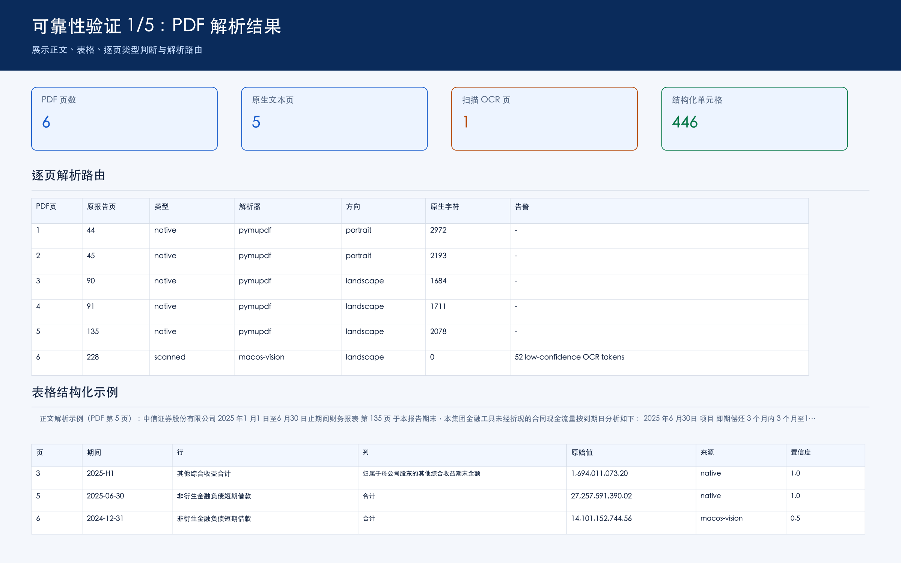

# 智能财务问答助手

面向混合型财务 PDF 的最小可运行原型。系统不把“大模型生成答案”当作可靠性的来源，而是通过逐页解析路由、坐标驱动表格恢复、结构化查询、证据引用和确定性校验形成闭环。默认演示界面仅使用 Python 标准库，网络不稳定时也能启动。

内置财务样本 `data/input/financial-report-sample.pdf` 共 6 页：

- 第 1-5 页存在文本层，但直接提取会丢失表格行列关系。
- 第 6 页是扫描图片，需要 OCR。
- 内容以跨页、多级表头、高密度财务表格为主。

## 核心能力

- 逐页检测 `native / mixed / scanned`，保存页面诊断信息。
- 原生页使用 PyMuPDF 坐标文本；扫描页在 macOS 使用 Vision OCR。
- 从坐标恢复期间、行、列、值，并保存原始值、置信度、来源和页码。
- 问题路由到结构化查询；证据不足时澄清或拒答。
- 检查引用、数字格式、OCR 置信度和行合计一致性。
- 黄金问题集与单元测试覆盖正文/表格、无答案、模糊问题、OCR 错误和回归。

## 工程思路

建议先阅读 [工程判断与可靠性闭环](docs/engineering-decisions.md)。它记录了真实 PDF 如何改变初始方案，以及每个关键判断如何被验证：

- 检查真实页面后，放弃“全部 OCR”，改为逐页选择解析器。
- 发现普通文本切块无法保留表格语义后，建立带行列、页码和坐标的证据层。
- 面对 OCR 异常数字，选择暴露不确定性，而不是自动猜测修正。
- 使用反向测试证明上传新 PDF 后旧知识库确实失效。
- 将解析、证据、校验、回答和运行事件分别输出，便于定位错误发生在哪一层。

AI Coding 的具体使用、错误假设和修正记录见 [AI Coding 协作与校验记录](docs/AI_USAGE.md)。运行项目后，可打开 <http://127.0.0.1:8501/reliability?section=reasoning> 查看决策与验证摘要。

## 快速开始

要求安装 [uv](https://docs.astral.sh/uv/)。当前 OCR 后端使用 macOS Vision；非 macOS 环境仍可解析原生文本页，但扫描页会明确报告 OCR 不可用。

```bash
make setup
make run
```

`make run` 会先自动加载并解析内置样本 PDF，然后启动网页。浏览器打开：

- 功能验证页面：<http://127.0.0.1:8501>
- 可靠性与工程验证页面：<http://127.0.0.1:8501/reliability>

功能验证页面支持：

1. 启动时自动加载 `data/input/financial-report-sample.pdf`。
2. 选择其他 PDF，点击“上传并自动解析”。
3. 等待页面提示解析完成，再进行问答、来源引用和自检验证。
4. 点击“重新加载内置样本”恢复标准演示数据。

上传失败会回滚到上一份可用文档。当前上传上限默认为 30 MB。

可通过环境变量调整运行配置：

```bash
DOCQA_HOST=127.0.0.1 DOCQA_PORT=8600 DOCQA_UPLOAD_LIMIT_MB=50 make run
```

完整测试与可靠性报告：

```bash
make all
```

可选 Streamlit 界面：

```bash
uv sync --extra streamlit
make run-streamlit
```



可复现的运行证据：

- [可靠性与工程验证报告](docs/reliability-report.md)
- [PDF 正文与表格解析截图](docs/reliability-01-pdf-parse.png)
- [代表性问答与边界行为截图](docs/reliability-02-qa-results.png)
- [来源引用与自检截图](docs/reliability-03-citations-checks.png)
- [测试与评估运行截图](docs/reliability-04-test-evaluation.png)
- [工程判断与 AI Coding 校验截图](docs/reliability-05-engineering-reasoning.png)
- [工程判断与可靠性闭环](docs/engineering-decisions.md)
- [运行保障与故障处理](docs/operations.md)
- 运行 `make report` 可重新生成可靠性报告与截图。
- 启动后打开 <http://127.0.0.1:8501/reliability>，可查看完整运行证据。

命令行问答：

```bash
uv run python -m docqa.cli ask "2025 年 6 月 30 日短期借款合计是多少？"
```

## 可靠性设计

回答状态不是简单的成功/失败：

- `supported`：证据存在且自检通过。
- `needs_review`：找到证据，但数字格式、OCR 置信度或计算校验失败。
- `clarification_required`：例如“短期借款是多少”缺少期间。
- `no_answer`：当前文档没有足够依据。

每个答案包含 PDF 页码、原报告页码、表格、行、列和 `cell_id`。财务数字不交给 LLM 猜测或修正。检测到类似 `26,075,352.，739.73` 的 OCR 异常时，系统保留原值并标记复核。

当前真实样本黄金集包含 10 个问题，检查答案状态、精确数值和来源页码。运行 `make eval` 后会生成 `artifacts/evaluation_report.json`。解析阶段还会生成：

- `diagnostics.json`：逐页类型、解析器、方向、文本字符数和告警。
- `cells.jsonl`：可追溯财务单元格证据。
- `validation_report.json`：数字格式、低置信度和行合计异常。
- `pages/`：用于人工复核和演示的页面图片。
- `events.jsonl`：结构化运行日志，记录解析、上传、问答状态、引用和耗时；不记录问题正文。

## 项目结构

```text
src/docqa/
  pdf_parser.py       # 逐页检测、原生文本、OCR 路由
  table_parser.py     # 坐标分行、表格识别、结构化单元格
  qa_agent.py         # 问题路由、检索、回答和拒答
  validation.py       # 证据与数字一致性校验
  evaluation.py       # 黄金集评估
web_app.py            # 默认零额外依赖 Web 演示
app.py                # 可选 Streamlit 演示
eval/                 # 黄金问题集
tests/                # 单元与行为测试
docs/                 # 设计、测试和可靠性说明
```

## 已知边界

- 当前原型针对财务表格的通用行列结构，不覆盖所有复杂合并单元格。
- macOS Vision 用于降低本地复现门槛；生产环境建议接入 PaddleOCR PP-StructureV3，并保留相同数据契约。
- 无外部 LLM Key 时使用确定性问题路由。生产环境可增加 LLM 意图解析，但最终数字仍必须来自结构化证据。
- 第 1 页从原报告中间截取，缺失前文时系统不会推断缺失行。
- 当前未实现 Docker、跨文档索引和人工复核后台；这些不影响单文档原型的解析、问答和评估闭环。

更完整的取舍和评估设计见 [docs/engineering-decisions.md](docs/engineering-decisions.md)、[docs/architecture.md](docs/architecture.md)、[docs/test-plan.md](docs/test-plan.md)、[docs/AI_USAGE.md](docs/AI_USAGE.md) 与 [docs/operations.md](docs/operations.md)。
